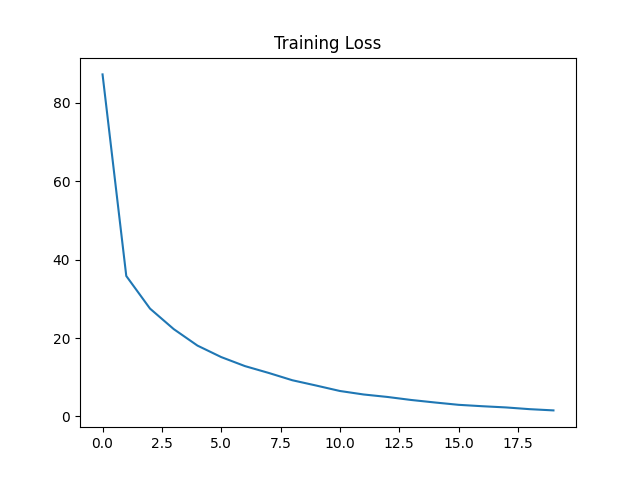

# Mini Deep Learning Framework (NumPy)

A modular deep learning framework built from scratch using NumPy to understand how libraries like PyTorch work internally.

---

## Highlights

* Built full forward + backward propagation engine from scratch
* Implemented modular layer system (Linear, ReLU, Sigmoid, Dropout)
* Implemented optimizers:

  * SGD
  * Adam (with bias correction)
* Supports mini-batch training with shuffling
* Train / Eval modes (for Dropout)
* Model save & load functionality
* Gradient checking using finite differences

---

##  Results

### XOR Task

* Successfully learned non-linear XOR function
* Final loss < 0.01

### MNIST Classification

* Model: `784 → 128 → 10`
* Optimizer: Adam
* Accuracy: **94%**
* Training: NumPy only (no PyTorch / TensorFlow)



---

## Quick Example

```python
from nn.layers import Linear
from nn.activations import ReLU
from nn.model import Sequential

model = Sequential([
    Linear(784, 128),
    ReLU(),
    Linear(128, 10)
])
```

---

## Architecture

This framework mimics PyTorch-style design:

* Each layer implements:

  * `forward()`
  * `backward()`
* Gradients flow layer-by-layer through the network
* Loss functions compute gradients w.r.t outputs
* Optimizers update parameters independently

Backprop pipeline:

Loss → Activation → Linear → ...

---

## Project Structure

```
nn/
  layers.py
  activations.py
  losses.py
  optim.py
  model.py

examples/
  xor.py
  mnist.py

tests/
  gradient_check.py
```

---

##  How to Run

```bash
pip install -r requirements.txt
python -m examples.mnist
```

---

## Motivation

This project was built to deeply understand:

* Backpropagation mechanics
* Computational graphs
* Optimizer design (Adam, SGD)
* Training pipelines in deep learning systems

---
